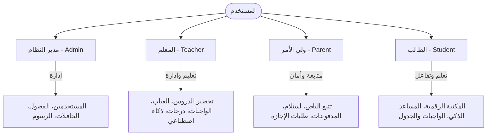
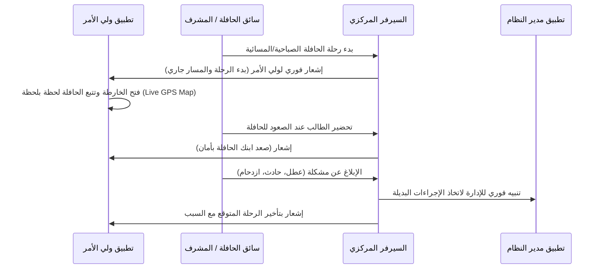
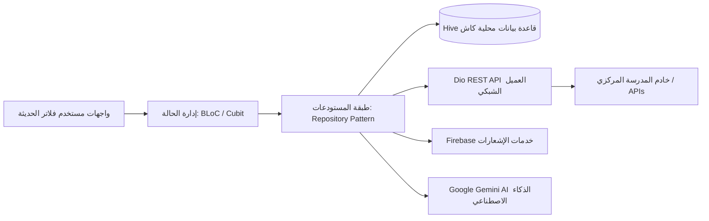

# وثيقة التحليل الفني لقطاع الأعمال (Business Analysis Document)
## نظام الإدارة المدرسية الشامل والمتكامل (Enterprise School Management ERP & LMS)

---

## 1. الملخص التنفيذي وقيمة الأعمال (Executive Summary & Business Value)

يعاني قطاع التعليم من تشتت الأدوات البرمجية المستخدمة في إدارة العمليات اليومية؛ حيث تستخدم المدارس عادةً نظاماً مستقلاً لإدارة شؤون الطلاب، ونظاماً آخر للتعليم الإلكتروني (LMS)، وتطبيقات منفصلة لتتبع الحافلات المدرسية، بالإضافة إلى الاعتماد على الطرق التقليدية في تنظيم انصراف الطلاب وحساب الرسوم.

هذا المشروع هو **نظام متكامل لإدارة المؤسسات التعليمية (Enterprise School ERP & LMS)**، تم تطويره باستخدام إطار العمل **Flutter (Dart)** ليعمل كمنصة موحدة تربط بين جميع أطراف العملية التعليمية: **إدارة المدرسة، المعلمين، الطلاب، وأولياء الأمور**. 

### القيمة التجارية والميزات التنافسية (Competitive Advantages):
1. **توفير التكاليف:** دمج أكثر من 5 أنظمة منفصلة (تتبع الباصات، منصة الواجبات، نظام الدفع، الذكاء الاصطناعي، ونظام الاستلام) في تطبيق واحد.
2. **الذكاء الاصطناعي التوليدي:** إدماج تقنيات **Google Gemini AI** لتمكين المعلمين والطلاب من رفع الكفاءة الأكاديمية بنسبة تصل إلى 40%.
3. **الأمان الفائق في الانصراف (Safe Dismissal):** حل المشكلة الكبرى التي تواجه المدارس يومياً أثناء انصراف الطلاب عبر نظام استلام إلكتروني ذكي يمنع التكدس المروري ويضمن أمان الأطفال.
4. **الشفافية المالية والتواصل اللحظي:** تمكين أولياء الأمور من متابعة كل ما يخص أبنائهم (مالياً، سلوكياً، أكاديمياً، وجغرافياً) لحظة بلحظة.

---

## 2. مصفوفة صلاحيات المستخدمين وسيناريوهات الاستخدام (User Personas & Role Matrix)

تم تصميم التطبيق ليدعم **أربعة أدوار رئيسية (4 Roles)** بواجهات مخصصة وتدفقات عمل متطابقة مع متطلبات كل فئة:



### مصفوفة الصلاحيات التفصيلية (Permissions & Feature Matrix):

| الميزة الوظيفية | مدير النظام (Admin) | المعلم (Teacher) | ولي الأمر (Parent) | الطالب (Student) |
| :--- | :---: | :---: | :---: | :---: |
| **إدارة الحسابات وقبول الطلاب الجدد** |  (المالك الكامل) | ❌ | ❌ (طلب تقديم فقط) | ❌ |
| **توليد الجداول الدراسية آلياً** |  (إنشاء وتحرير) | ❌ (عرض فقط) | ❌ (عرض فقط) | ❌ (عرض فقط) |
| **مساعد الذكاء الاصطناعي للتحضير والاختبارات**| ❌ |  (توليد كامل للدروس/الاختبارات) | ❌ |  (مساعد للمذاكرة وتلخيص الملاحظات) |
| **تسجيل الحضور والغياب اليومي** | ❌ (تلقي التقارير) |  (تسجيل وتعديل) | ❌ (عرض الغياب فقط) | ❌ (عرض الغياب فقط) |
| **إدارة شؤون الحافلات وتتبع الرحلات** |  (إعداد وتتبع كامل) |  (تتبع الحضور للحافلة) |  (تتبع لحظي بالخارطة واستقبال تنبيهات) |  (تتبع باص المدرسة) |
| **نظام الاستلام الذكي (Pickup Dismissal)** |  (إدارة البوابة والتقارير) |  (تجهيز الطلاب بالفصل) |  (إرسال نداء عند الوصول) | ❌ (تلقي الإشعار بالانصراف) |
| **إدارة الدرجات والامتحانات والواجبات** | ❌ (عرض التقارير) |  (إنشاء واجبات وتقييم) |  (متابعة النتائج فقط) |  (حل الواجبات ورفعها) |
| **الإدارة المالية (الرسوم والدفع)** |  (ضبط مالي ومتابعة مدفوعات) | ❌ |  (عرض رصيد وتاريخ دفع ورسائل استلام) | ❌ |
| **إدارة متجر الزي المدرسي** |  (متابعة طلبات القياس والمخزون) | ❌ |  (إرسال قياسات الأبناء والطلب) | ❌ |
| **طلبات الإذن والإجازات** |  (موافقة/رفض الطلبات) | ❌ |  (تقديم طلبات إذن وغياب) | ❌ |
| **المحادثات المباشرة والتواصل** |  (محادثة الكل) |  (محادثة أولياء الأمور والإدارة) |  (محادثة المعلمين والإدارة) | ❌ |

---

## 3. التحليل التفصيلي للوحدات والميزات الوظيفية (Feature Modules & Workflows)

### 3.1. نظام القبول والتسجيل وإدارة المستخدمين (Admission, Directory & Core Admin Tools)
* **الوصف التجاري:** يمثل حجر الأساس للتطبيق؛ حيث يسهل عمليات إدخال البيانات المدرسية وتخفيف العبء الإداري الورقي.
* **تدفق العمل (Workflow):**
  1. يقوم ولي الأمر بتقديم "طلب تقديم قبول جديد" (Admission Request) عبر تعبئة بيانات الطالب ومرحلته الدراسية ورفع المستندات المطلوبة.
  2. يتلقى المسؤول (Admin) إشعاراً بالطلب على شاشة لوحة تحكم الإدارة لدراسته والموافقة عليه أو رفضه.
  3. عند القبول، يتم آلياً إنشاء حساب للطالب وتحديد صفه الدراسي، وربطه بحساب ولي الأمر لتسهيل المتابعة المباشرة.
* **مولد الجداول الآلي (Admin Schedule Generator):** ميزة ذكية تمكن الإدارة من إدخال المواد وتوزيع الحصص الأسبوعية على الفصول والمعلمين، ليتولد الجدول آلياً ويظهر فوراً في حسابات الطلاب والمعلمين المعنيين، مانعاً أي تداخل في جداول المعلمين أو القاعات الدراسية.

---

### 3.2. نظام الذكاء الاصطناعي التوليدي المتكامل (Gemini AI Services)
يعد إدماج الذكاء الاصطناعي التوليدي نقلة نوعية ترفع من كفاءة العمل الأكاديمي، ويتكون من شقين رئيسيين:

#### أ. مساعد المعلم الذكي (Teacher AI Assistant):
* **توليد أفكار الدروس (Lesson Ideas Generator):** يكتب المعلم اسم المادة والموضوع والفئة العمرية، ليقترح عليه نموذج Gemini خطة درس تفاعلية مذهلة، تشمل الأنشطة الصفية وأساليب الشرح.
* **توليد الاختبارات السريعة (Quiz Creator):** يقوم بتوليد بنك أسئلة متنوع (اختيار من متعدد، صح وخطأ، أسئلة مقالية) بناءً على المحتوى الدراسي المحدد وبثوانٍ معدودة، مع إمكانية تحويلها لورقة عمل PDF مباشرة.
* **ملخص ملاحظات الفصل (Class Notes Summarizer):** يساعد المعلم في تنظيم وتلخيص الملاحظات اليومية المبعثرة وصياغتها في شكل نقاط إرشادية واضحة لإرسالها للطلاب.

#### ب. مساعد الطالب الذكي (Student AI Assistant):
* **المذاكرة والتلخيص الفعال:** يعمل كمدرس خصوصي تفاعلي يجيب عن أسئلة الطالب العلمية ويشرح المفاهيم المعقدة بطرق مبسطة، وتلخيص الدروس الطويلة لزيادة التحصيل الدراسي، مع توفير بيئة آمنة ومراقبة تربوياً.

---

### 3.3. إدارة الحضور والغياب (Attendance Tracking Hub)
* **الوصف التجاري:** ضمان الانضباط المدرسي وإعلام أولياء الأمور بغياب أبنائهم فوراً لضمان سلامتهم.
* **آلية العمل:**
  * يدخل المعلم إلى شاشة "تسجيل الغياب اليومي" (Recording Absence Screen) حيث يظهر طلاب الفصل الدراسي الخاص به مع صورهم وبياناتهم.
  * بلمسة واحدة، يقوم بتحديد الطلاب (حاضر، غائب، متأخر، إذن طبي).
  * بمجرد حفظ القائمة، يقوم النظام بالتالي:
    1. إرسال إشعار فوري (Push Notification) لهاتف ولي الأمر إذا كان ابنه غائباً أو متأخراً.
    2. تحديث سجل الطالب التراكمي في قاعدة البيانات لاستخراج تقارير الغياب الشهرية لمدير المدرسة.

---

### 3.4. نظام النقل والمواصلات المدرسية الذكي (School Bus & Fleet Tracking)
يتعدى هذا النظام مجرد تسجيل الطلاب في الحافلات، بل يعتبر نظام أمن وتتبع متكامل:



* **الميزات الإضافية:**
  - **الاتصال بالسائق (Connect Driver):** وسيلة تواصل أمنة ومباشرة مع مشرف أو سائق الرحلة لحالات الطوارئ.
  - **تنبيهات جغرافية (Geofencing notifications):** إرسال تنبيه آلي لولي الأمر عندما تقترب الحافلة من المنزل بمسافة 1 كم للاستعداد.

---

### 3.5. نظام استلام الطلاب الذكي والآمن (Safe Dismissal & Pickup System)
يحل التطبيق المشكلة الأزلية للازدحام المروري والمخاوف الأمنية حول بوابات المدارس أثناء انصراف الطلاب عبر دورة عمل رقمية دقيقة:

```
[ولي الأمر يصل لمحيط المدرسة]
         │
         ▼
[يضغط ولي الأمر على "أنا هنا للاستلام" عبر التطبيق]
         │
         ▼
[يصل تنبيه فوري وبصري لشاشة المعلم داخل الفصل وشاشة مشرف البوابة]
         │
         ▼
[يتحول مؤشر حالة الطالب من "قيد الانتظار Pending 🟡" إلى "جاري التجهيز Preparing 🔵"]
         │
         ▼
[يقوم المعلم بتوجيه الطالب لبوابة الخروج]
         │
         ▼
[مشرف البوابة يؤكد استلام ولي الأمر للطالب]
         │
         ▼
[تتحول الحالة إلى "تم الاستلام Picked Up 🟢" وإرسال إشعار تأكيدي لهاتف ولي الأمر والأم]
```

* **حالات استلام الطلاب المعتمدة برمجياً:**
  1.  **Pending 🟡 (قيد الانتظار):** الطالب بالفصل الدراسي واليوم الدراسي انتهى، بانتظار وصول ولي الأمر.
  2.  **Preparing 🔵 (جاري التجهيز):** نادى ولي الأمر على الطالب، ويقوم المعلم بإعداده وتجهيز حقيبته وخروجه من الفصل.
  3.  **Ready 🟢 (جاهز للاستلام):** الطالب وصل لمنطقة الانتظار الآمنة عند بوابة المدرسة.
  4.  **Picked up 🔴 (تم الاستلام):** غادر الطالب المدرسة بصحبة الشخص المخول له قانوناً بالاستلام.

---

### 3.6. إدارة الدرجات والاختبارات والواجبات (Gradebook & LMS Hub)
* **المعلم:** ينشئ واجبات إلكترونية (Create Assignment)، يحدد تاريخ تسليمها، ويرفع ملفات أو مصادر مساعدة للمكتبة الرقمية (Digital Library).
* **الطالب:** يرى قائمة الواجبات القادمة وتواريخ استحقاقها في شاشته الرئيسية، ويستطيع حلها ورفع المرفقات (صور، PDF)، وتصفح المكتبة الرقمية لتحميل الكتب والمذكرات الدراسية.
* **ولي الأمر:** يستعرض تقييمات ودرجات أبنائه بشكل فوري ومقارنتها بمتوسط درجات الفصل لملاحظة الصعود والهبوط في المستوى الدراسي، واستقبل إشعارات تفوق أو تنبيه بضعف أكاديمي.

---

### 3.7. الإدارة المالية ورصيد الطلاب (Financials & Payment Gateways)
* **الوصف التجاري:** تحسين التدفقات النقدية للمدرسة وتسهيل دفع الرسوم دون الحاجة لزيارة مقر المدرسة.
* **الميزات المتوفرة:**
  - **تفصيل الرسوم (Financial Settings Screen):** إدخال الإدارة لقيمة الرسوم الدراسية، رسوم الحافلة، ورسوم الأنشطة السنوية والخصومات.
  - **شاشة الرصيد المالي للطالب (Show Student Balance Screen):** تتيح لولي الأمر معرفة إجمالي الرسوم المفروضة، المدفوع منها، والمبالغ المتبقية المستحقة.
  - **سجل المدفوعات والفواتير (Payment History & Receipts):** عرض تفصيلي لعمليات السداد السابقة مع إمكانية تحميل وطباعة "سند قبض مالي" (Payment Receipt PDF) معتمد ومطابق للقوانين الضريبية (ضريبة القيمة المضافة VAT).

---

### 3.8. نظام الإجازات والأذونات (Leave & Permission Management)
* **المشكلة:** تقديم الأعذار الطبية أو طلبات الاستئذان الطارئة عبر الأوراق يعرضها للفقدان أو التزوير.
* **الحل البرمجي:**
  - يقدم ولي الأمر طلب إذن (Leave Parent Screen) يحدد فيه تاريخ الإجازة، سبب الغياب (مرضي، عائلي، سفر)، وكتابة أي ملاحظات.
  - يظهر الطلب فوراً في لوحة تحكم مدير النظام (Leave Admin Screen) مع كامل تفاصيل الطالب؛ ليقوم بالقبول أو الرفض مع ذكر السبب.
  - يتلقى ولي الأمر إشعاراً فورياً بنتيجة الطلب، وإذا تمت الموافقة، يتم إدراج الطالب آلياً كـ "غائب بعذر مقبول" في كشوف الحضور والغياب الخاصة بالمعلمين خلال فترة الإجازة المعتمدة.

---

### 3.9. نظام متجر الزي المدرسي الذكي (Smart Uniform Store)
* **الوصف التجاري:** تجنب الأخطاء الشائعة في اختيار قياسات الزي المدرسي وتوفير الوقت والمجهود لأولياء الأمور والمدرسة.
* **الميزات برمجياً:**
  - يدخل ولي الأمر طول الطالب (Height cm)، وزنه (Weight kg)، ويختار المقاس المفترض.
  - يقوم النظام بمطابقة القياسات آلياً مع جداول المقاسات الخاصة بالمدرسة للتوصية بالمقاس المثالي (Size Recommendation).
  - يستقبل مدير شؤون الطلاب الطلبات على شاشة الإدارة (Uniform Admin Screen) لتجهيز الطلبات وتوزيعها وتحديث المخزون بشكل آلي، مع إشعار ولي الأمر عند جاهزية الزي للاستلام.

---

## 4. التحليل التقني وتصميم النظام (Technical & Architectural System Design)

تم بناء التطبيق باتباع أفضل الممارسات البرمجية العالمية لضمان سرعة الاستجابة، سهولة الصيانة، وقابلية التوسع (Scalability):



### التقنيات الأساسية بالتطبيق (Core Tech Stack):
1. **أداة بناء الواجهات وإطار العمل:** **Flutter SDK** مع لغة البرمجة **Dart**.
2. **معمارية الكود (Architecture):** **معمارية الميزات النظيفة (Feature-First Clean Architecture)**؛ لضمان فصل منطق الأعمال بالكامل عن الواجهات البصرية مما يسهل التطوير المتوازي من قبل عدة مبرمجين.
3. **إدارة الحالة (State Management):** **BLoC / Cubit Pattern** وهي التقنية المعيارية لضمان أداء سلس وتحديث فوري للمعلومات بدون أي إهدار لموارد الجهاز.
4. **الربط مع السيرفر والشبكات:** **Dio client** لدعم بروتوكولات RESTful APIs بشكل آمن وموثوق، مع تفعيل ميزات محاولات الاتصال التلقائي وإدارة الأخطاء الذكية.
5. **قاعدة البيانات المحلية الكاش (Local Caching):** استخدام **Hive** (قاعدة بيانات NoSQL محلية فائقة السرعة) لحفظ بيانات تسجيل الدخول وتفضيلات النظام وتخزين البيانات مؤقتاً ليعمل التطبيق بكفاءة حتى عند ضعف أو انقطاع شبكة الإنترنت (Offline Mode).
6. **الخدمات السحابية والتنبيهات:** **Firebase Core & Messaging** لإدارة عملية إرسال التنبيهات الفورية الفائقة السرعة إلى هواتف المستخدمين.
7. **إعدادات التدويل واللغات:** تطبيق مكتبة **Easy Localization** لتقديم تجربة ثنائية اللغة بالكامل وبشكل احترافي (**العربية / الإنجليزية**)، مع دعم اتجاهات واجهة المستخدم آلياً (LTR/RTL).

---

## 5. خارطة الطريق والتطويرات المستقبلية (Product Roadmap & Innovation)

لضمان ريادة التطبيق واستدامته، نوصي بخطة تطوير تشمل المراحل التالية:

### الربع الأول (Q1): التحسينات الأمنية والمدفوعات الفورية
* دمج بوابات دفع إلكتروني محلية وعالمية مباشرة في التطبيق (مثل Stripe, Apple Pay, Mada) لتسهيل الدفع الفوري لرسوم الدراسة والزي المدرسي.
* تفعيل نظام مصادقة بيومترية (بصمة الإصبع Face ID / Touch ID) لضمان أمان العمليات المالية وأذونات الخروج.

### الربع الثاني (Q2): التلعيب وزيادة التفاعل (Gamification in Education)
* إطلاق نظام النقاط والمكافآت للطلاب؛ حيث يحصل الطالب على شارات رقمية ونقاط عند حل الواجبات في وقت مبكر وحضور الفصل والانضباط.
* إمكانية استبدال النقاط بمكافآت عينية من كافتيريا المدرسة أو متجر الأدوات المدرسية، مما يزيد من دافعية وحب الطلاب للتعليم.

### الربع الثالث (Q3): تحليلات الذكاء الاصطناعي التنبؤية (Predictive AI)
* تطوير المساعد الذكي ليقوم بتحليل درجات وسلوك وحضور الطالب التاريخي والتنبؤ بمستواه الدراسي المستقبلي.
* إرسال تنبيهات استباقية مبكرة للإدارة والمعلمين وأولياء الأمور في حال وجود مؤشرات على تراجع مستوى الطالب الأكاديمي أو زيادة احتمالية غيابه، مع تقديم اقتراحات علاجية مخصصة مدعومة بالذكاء الاصطناعي.

---

## 6. تحليل SWOT واستراتيجية النجاح (SWOT & Success Strategy)

### نقاط القوة (Strengths):
* **تكامل فائق شامل:** تغطية 4 أدوار بمتطلباتهم الحياتية واليومية كافة داخل بيئة تقنية واحدة وسلسة.
* **دقة متناهية في الأمان:** توفير حل جذري لمشكلة أمان خروج وانصراف الطلاب، مما يجذب المدارس المهتمة بجانب السلامة والأمان.
* **أدوات تعليم متطورة:** دمج Gemini AI يعطي التطبيق جاذبية وحداثة ترويجية قوية جداً تميزه عن الأنظمة التقليدية القديمة.

### نقاط الضعف (Weaknesses):
* **تعدد الميزات الضخم:** قد يتطلب وقتاً أطول لتدريب موظفي المدرسة وإدارتها على استغلال كافة قدرات التطبيق.
* **الاعتماد على اتصال الإنترنت:** تتطلب ميزات التتبع اللحظي للباص والـ Pickup شبكة إنترنت مستقرة ومستمرة من السائقين وأولياء الأمور.

### الفرص (Opportunities):
* **التحول الرقمي الإجباري:** توجه الحكومات والوزارات التعليمية لرقمنة التعليم بالكامل ووقف الهدر الورقي.
* **التوسع في المدارس الخاصة والدولية:** المدارس الأهلية والدولية مستعدة لدفع اشتراكات مجزية جداً للحصول على تطبيق مخصص بهويتها يعكس صورتها الحديثة أمام أولياء الأمور.

### التهديدات (Threats):
* **الشركات القديمة المسيطرة:** منافسة بعض الأنظمة الإدارية التي تمتلك حصصاً سوقية قديمة، على الرغم من افتقارها للذكاء الاصطناعي والتتبع اللحظي.
* **خصوصية البيانات وسريتها:** الأهمية القصوى لتأمين بيانات الطلاب وعناوين تتبع باصاتهم ضد أي اختراق، مما يستلزم تطبيق بروتوكولات حماية وتشفير متكاملة ومستمرة.

---

> **ملاحظة التحليل:** تم صياغة وتوثيق هذه الدراسة البرمجية والتحليل الفني للعمليات لمساعدة المطورين والمستثمرين وإدارة المدرسة على فهم كل زاوية وخطوة في هذا التطبيق الريادي لضمان انسجام التطوير التقني مع أهداف قطاع الأعمال.
